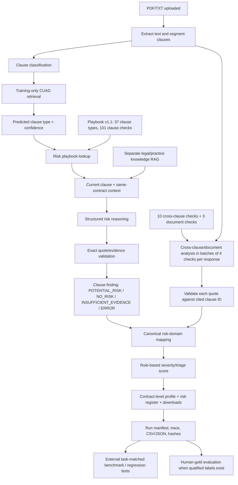

# Phase 2 Contract Risk System — Logical Model and Reproduction Notes

## 1. What this system answers

The system keeps four different questions separate:

1. **Clause classification:** what type of provision does the text resemble?
2. **Risk predicate:** what concrete buyer-side condition should be checked?
3. **Contract evidence:** is the condition supported by the uploaded agreement?
4. **Evaluation truth:** do independent labels tell us whether the decision was correct?

The playbook is a test specification, not evidence. RAG examples and legal/practice sources are guidance. A positive risk finding must cite the uploaded contract.

## 2. End-to-end logical graph



## 3. Taxonomy, checks and risk domain

The current source-of-truth playbook is `data/risk/commercial_clause_risk_playbook.json`, source version 1.1:

- 37 clause types (36 CUAD-substantive types plus supplemental Indemnification)
- 101 clause-level checks
- 10 cross-clause checks
- 3 document-level checks
- 10 canonical domains in `backend/data/legal_knowledge/risk_taxonomy.json`

The **declared playbook domain is authoritative** for routing/aggregation. A finer old label is preserved as `risk_subdomain`; text/keyword matches are emitted as supplemental suggestions only. Neither the taxonomy nor a check definition establishes facts about a contract.

Each check has an ID, question, `flag_if`, sometimes `do_not_flag_if`, evidence constraints, dependencies, and source references. `FLAG IF` governs risk polarity: the natural-language question may be answered YES while the risk label is NO, or vice versa.

## 4. The three scopes of analysis

### Clause-level
For an extracted clause, the system predicts a CUAD category, obtains applicable playbook checks, passes the clause and related same-contract context to the risk model, and validates evidence quotes. The classification retrieval index contains training contracts only.

### Cross-clause
Ten checks inspect relationships such as liability cap vs indemnification, liability cap vs liquidated damages, assignment vs change of control, termination vs minimum commitment, and IP ownership vs license rights. These checks can require multiple clause IDs. The engine currently requests four check definitions per model response to reduce JSON truncation; if a batch fails, only that batch's checks fall back to insufficient evidence.

### Document-level
Three checks examine incorporated materials/package completeness, precedence terms, and governing-law/forum/dispute consistency. Missing referenced documents should be marked unread/unknown or insufficient; absence from an incomplete packet is not proof that a term is absent from the full executed contract.

## 5. Retrieval and evidence boundaries

- **CUAD classification retrieval:** similar labeled examples from the training-only index.
- **Same-contract context retrieval:** related clauses from the uploaded agreement.
- **Legal/practice RAG:** separate authority/guidance records.
- **Contract evidence:** exact text from the uploaded agreement and cited clause ID.

External guidance can help explain why a predicate matters, but it cannot prove that the agreement contains the relevant term. Exact quote validation checks provenance, not semantic/legal correctness.

## 6. Outputs and traceability

Each uploaded run should preserve:
- original file hash and run/analysis ID;
- extracted/segmented clause list;
- predicted CUAD category, retrieval and risk-check results;
- risk status, evidence quote, cited clause IDs, rationale and severity/score when available;
- cross/document check outputs and unresolved checks;
- configuration/playbook/calibration and code fingerprints;
- CSV/JSON/report/download paths;
- progress trace and reproducibility manifest.

The primary operational artifact is the per-run folder under `data/runs/<analysis_id>/`.

## 7. Evaluation sources and claims

The project has three different evidence sources:

1. **External CUAD expert-derived data:** suitable for the mapped clause/category presence/evidence task. It is not gold for the custom buyer-side risk predicates.
2. **Machine-silver risk queue (300 tasks):** useful for reproducibility, disagreement, abstention and error analysis. It is not human gold; its observed labels must not be used to claim custom-risk accuracy.
3. **Synthetic cross/document matrix (39 cases):** three authored scenarios for each of 10 cross-clause and 3 document-level checks. This is a regression test. Its status-conformance rate measures fixture behavior only, not real-world generalization.

Current one-shot-vs-batched synthetic comparison: 11/39 (28.2%) vs 27/39 (69.2%) expected-status matches on the same authored fixtures. Batching reduced the failure where a single oversized JSON response caused all 13 checks to abstain. The result does **not** establish legal-risk accuracy; the protected-control set still has false positives/abstentions, and some positive cases are missed.

The 300-row human annotation queue remains unannotated. Final custom-risk accuracy requires qualified labels and adjudication, or a different external benchmark whose label semantics genuinely match the specific claims being measured.

## 8. Important commands

From repository root:

```bash
.venv/bin/python scripts/risk/validate_evaluation_integrity.py
.venv/bin/python scripts/risk/normalize_playbook_domains.py
.venv/bin/python scripts/risk/export_team_pack.py
.venv/bin/python scripts/risk/build_cross_document_scenario_suite.py
.venv/bin/python scripts/risk/audit_cross_document_scenario_suite.py
.venv/bin/python scripts/risk/run_cross_document_model_scenarios.py --passes 1 --resume
.venv/bin/python scripts/risk/render_cross_document_model_report.py
.venv/bin/python scripts/risk/compare_cross_document_model_runs.py
PYTHONPATH="$PWD:$PWD/backend:$PWD/.venv/lib/python3.12/site-packages" pytest -q backend/tests
```

For the full release check, stop the backend first because the embedded/local Qdrant store enforces an exclusive lock. Then run `scripts/risk/run_release_checks.py`, restart the backend, and verify `GET /health`. The release check includes upload-smoke audits and regenerates the reproducibility report.

## 9. Limitations

This is a screening/review aid, not autonomous legal advice. The current test fixtures are authored synthetic examples; the model-silver set is machine-labeled; custom-risk accuracy and calibrated severity are therefore unmeasured. The score is deterministic review triage, not a probability of loss. The risk playbook expresses a buyer-side review policy and may need jurisdiction-specific review before operational use.
